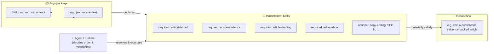

<div align="center">

# ArgoLab

**Reusable compositions of independent Skills, organized around one concrete outcome.**

[](#status)
[](LICENSE)
[](https://github.com/boussecsou/argos-lab/actions/workflows/ci.yml)
[](CONTRIBUTING.md)

[Overview](#overview) · [How an argo works](#how-an-argo-works) · [Repository layout](#repository-layout) · [Evidence so far](#evidence-so-far) · [Contributing](#contributing)

</div>

---

## Overview

An **argo** is a modular, reusable package that organizes independent **Skills** around a shared class of outcome — a *Destination* — so an AI system doesn't have to rediscover which capabilities belong together every time a similar task shows up.

It sits deliberately between two extremes:

| | Free Skills | **Argo** | Rigid workflow |
|---|:---:|:---:|:---:|
| Skills stay independently reusable | ✅ | ✅ | ❌ |
| Composition is reusable, not rediscovered each time | ❌ | ✅ | ✅ |
| Runtime keeps control of execution order | ✅ | ✅ | ❌ |

An argo is **not** a domain catalogue and **not** a rigid workflow. Its root `SKILL.md` describes the result to reach, the capabilities that belong together, participation rules, and resolution semantics — the runtime still decides execution order and mechanics.

> A Skill makes one capability reusable. An argo makes a *composition* of Skills reusable around a shared outcome.

## How an argo works



Each Skill keeps its own identity, instructions, and independent reuse elsewhere. The argo's only job is to declare **why these specific capabilities belong together** for a recurring type of result — participation rules (required vs. optional) and resolution semantics (embedded, reference, or dynamic binding) live in the root contract, not inside the Skills themselves.

## Repository layout

```text
prototypes/                  Reusable Argo packages
  argo-write-article/          → produce a publishable, evidence-backed article
  argo-resolve-hard-bug/       → diagnose, fix, test, and review a difficult defect
experiments/                 Controlled studies evaluating the argo model
  e1.1/                         → Argo vs. free-Skills capability-coverage experiment
docs/                        Normative specification docs (in progress)
skills/                      Standalone authoring/audit Skills
  argo-creator/                 → canonical Argo authoring and audit Skill
```

Each Argo package centers on:

| File / folder | Purpose |
|---|---|
| `SKILL.md` | Normative local contract — authoritative for both humans and agents. |
| `argo.json` | Machine-readable manifest; must agree with `SKILL.md`. |
| `skills/` | Embedded member Skills, when the package ships them directly. |
| `references/` | Supporting material, loaded only when useful. |

## Evidence so far

The argo model is tested empirically before anything is standardized. The first controlled experiment, **E1.1**, compared `argo-write-article` against the same four Skills exposed independently:

| Measure | Free Skills | Argo | Delta |
|---|---:|---:|---:|
| Mean required-capability coverage | 1.000 | 1.000 | 0.000 |
| Mean blind quality score / 10 | 9.73 | 9.60 | −0.13 |
| Paired wins (of 5 models) | 0 | 0 | 5 ties |

**Verdict: inconclusive** — both conditions hit the rubric ceiling, so this batch didn't isolate a routing advantage for the argo layer. Full protocol, deviations, and the next-batch plan: [`experiments/e1.1/results/summary.md`](experiments/e1.1/results/summary.md).

This result already shaped project direction: an argo is not justified by claiming it routes Skills better. Its more defensible value is making a *meaningful, reusable composition* of Skills available for a recurring outcome — a claim this repo keeps testing rather than asserting.

## Status

This repository and the argo model are **experimental / pre-specification**. The working strategy is:

```
build real argos → observe usage → run targeted experiments → publish results → standardize only what survives real use
```

Claims about quality, routing, portability, or token efficiency are only made where an experiment backs them up.

## Contributing

Contributions are welcome — new Argo packages, experiments, or fixes to existing ones.

1. Read [AGENTS.md](AGENTS.md) first: it covers public-repository safety, Argo authoring constraints, Conventional Commits, and the Notion source-of-truth links.
2. Read [CONTRIBUTING.md](CONTRIBUTING.md) for the contribution workflow and PR expectations.
3. This project follows the [Code of Conduct](CODE_OF_CONDUCT.md).
4. Found a security issue? See [SECURITY.md](SECURITY.md) — please don't open a public issue.

## License

[MIT](LICENSE)
